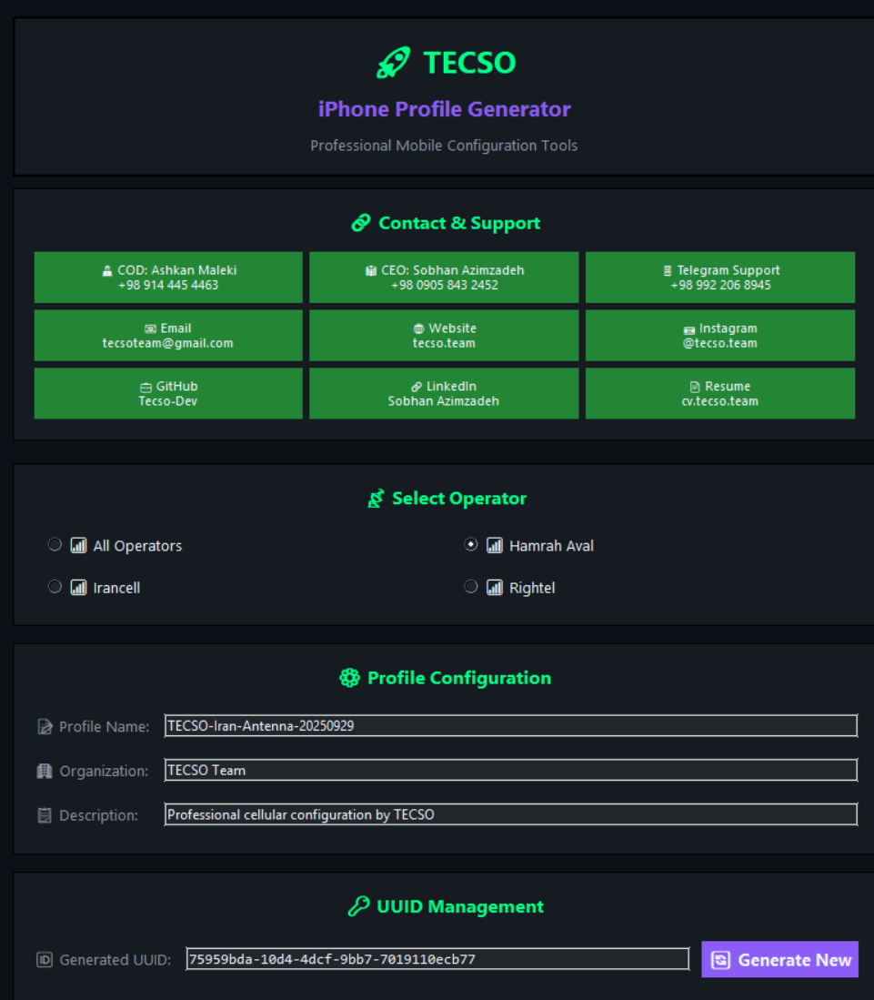

# 🚀 سازنده پروفایل آیفون TECSO

<div align="center">


[](https://opensource.org/licenses/MIT)  
[](https://python.org)  
[](https://windows.com)  
[](https://apple.com)  

**مجموعه حرفه‌ای کانفیگ موبایل برای شبکه‌های ایران**  

*دور زدن محدودیت‌ها • حفظ اتصال پایدار • ابزارهای حرفه‌ای*  

</div>  

---

## 🌟 معرفی

سازنده پروفایل آیفون TECSO یک مجموعه کامل و حرفه‌ای برای ساخت پروفایل‌های پیکربندی موبایل برای کاربران آیفون در ایران است. این راهکار به شما کمک می‌کند تا با تولید شناسه‌های یکتا و فایل‌های کانفیگ کامل، اتصال پایدار شبکه تلفن همراه را حفظ کنید.

### ✨ ویژگی‌های کلیدی

- 🆔 **تولید UUID** - ساخت شناسه‌های یکتا برای جلوگیری از بلاک شدن پروفایل  
- 📱 **تولید قالب** - ساخت فایل‌های کامل پیکربندی موبایل  
- 🎨 **رابط کاربری مدرن** - تم تاریک حرفه‌ای با رنگ‌های نئونی  
- 🔧 **پشتیبانی چند اپراتور** - همراه اول، ایرانسل، رایتل، همه شبکه‌ها  
- 💾 **ذخیره آسان** - خروجی به صورت فایل `.mobileconfig` جهت نصب در آیفون  
- 🚀 **برنامه‌های مستقل** - بدون نیاز به نصب، تنها کافیست اجرا کنید  

---

## 📸 اسکرین‌شات‌های برنامه

<div align="center">

### 🚀 لانچر حرفه‌ای TECSO
*مرکز اصلی دسترسی به تمام ابزارهای TECSO*


---

### 🆔 تولید UUID
*ساخت شناسه‌های یکتا برای پروفایل‌های موبایل*


---

### 📱 تولید قالب
*ایجاد پروفایل‌های کامل کانفیگ موبایل*



---

### 📋 کانفیگ ساخته‌شده
*پیش‌نمایش زنده XML پروفایل*


</div>

> **📝 نکته:** برای گرفتن اسکرین‌شات:  
> 1. برنامه‌ها را از پوشه `dist/` اجرا کنید  
> 2. از رابط هر ابزار اسکرین‌شات بگیرید  
> 3. تصاویر را در پوشه `screenshots/` ذخیره کنید  
> 4. اندازه پیشنهادی: 1200x800 پیکسل برای بهترین کیفیت  

---

## 🛠️ ابزارهای موجود

### 1. 🆔 تولید UUID
ساخت شناسه‌های یکتا برای پروفایل‌های موبایل جهت جلوگیری از بلاک شدن در صورت استفاده همزمان چند دستگاه.  

**امکانات:**  
- ⚡ تولید سریع UUID  
- 📋 کپی با یک کلیک  
- 🔑 پشتیبانی از فرمت استاندارد و HEX  
- 🎯 رابط کاربری حرفه‌ای  

### 2. 📱 تولید قالب  
ایجاد پروفایل‌های کامل با تنظیمات دلخواه.  

**امکانات:**  
- 📡 پشتیبانی از چند اپراتور (همراه اول، ایرانسل، رایتل)  
- ⚙️ تنظیمات APN سفارشی  
- 🔧 گزینه‌های پیشرفته احراز هویت  
- 💾 امکان ذخیره/بارگذاری پروفایل  
- 🎨 پیش‌نمایش زنده XML  

### 3. 🚀 لانچر حرفه‌ای  
مرکز اصلی دسترسی به ابزارها و اطلاعات تماس.  

**امکانات:**  
- 🎯 دسترسی سریع به ابزارها  
- 📞 دکمه‌های تماس یکپارچه  
- 🌐 لینک‌های مستقیم به منابع TECSO  
- ✨ طراحی مدرن رابط کاربری  

---

## 📱 اپراتورهای پشتیبانی‌شده

<div align="center">

| اپراتور | نوع APN | سطح پشتیبانی | وضعیت |
|----------|----------|---------------|---------|
| 📶 همراه اول | `mcinet` | ✅ کامل | فعال |
| 📶 ایرانسل | `mtnirancell` | ✅ کامل | فعال |
| 📶 رایتل | `mcinet` | ✅ کامل | فعال |
| 📶 همه شبکه‌ها | `Universal` | ✅ کامل | فعال |

</div>

---

## 🎯 شروع سریع

### روش 1: استفاده از نسخه‌های آماده
1. **دانلود** آخرین نسخه از مخزن  
2. **اجرا** `TECSO-Launcher-Updated.exe` برای دسترسی به رابط اصلی  
3. **انتخاب** ابزار مورد نظر (UUID Generator یا Template Generator)  
4. **ساخت** پروفایل یکتا و ذخیره به صورت `.mobileconfig`  
5. **انتقال** به آیفون و نصب از بخش تنظیمات  

### روش 2: اجرای سورس کد
```bash
# کلون کردن مخزن
git clone https://github.com/Tecso-Dev/Iphone-14-15-IRAN-Anten.git

# ورود به پوشه
cd Iphone-14-15-IRAN-Anten

# ساخت محیط پایتون
python -m venv .venv
.venv\Scripts\activate

# نصب وابستگی‌ها
pip install pyperclip

# اجرای ابزارها
python uuid-Generator.py
python template-generator.py
python launcher.py
